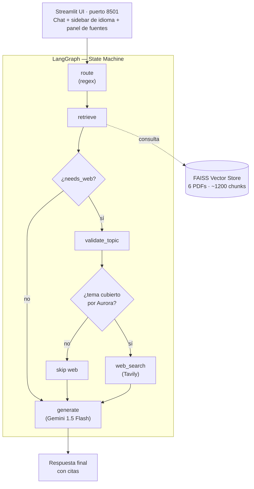

# -ChallengeAluraAgente

# 🤖 Aurora RAG Agent

Agente de Inteligencia Artificial con arquitectura **RAG** (Retrieval-Augmented Generation) que responde preguntas basadas en la documentación oficial de **Aurora AI Studio S.A.S.**, una empresa ficticia SaaS de soluciones de IA.

Construido para el **Challenge Alura Agente** — programa Oracle Next Education + Alura Latam.

---

## ✨ Características principales

| Feature | Descripción |
|---------|-------------|
| **RAG con FAISS** | Recuperación semántica de chunks desde 6 PDFs indexados localmente |
| **LangGraph orchestration** | Grafo de estados: `route → retrieve → [validate_topic → web_search] → generate` |
| **Gate determinista para web** | Solo busca en internet si el usuario lo pide explícitamente (regex, no LLM) |
| **Validación de tema** | Cuando se pide web, un clasificador LLM verifica que el tema esté cubierto por Aurora |
| **Multi-idioma ES/EN** | Selector en sidebar que fuerza respuesta monolingüe (efecto espejo UI) |
| **Citas enriquecidas** | Cada afirmación cita `[archivo.pdf, pág. N, § Sección]` |
| **Umbral de similitud** | Filtra chunks irrelevantes (configurable, default 0.50) |
| **Streamlit UI** | Chat interactivo con historial, panel de fuentes y preguntas de ejemplo |
| **Docker + OCI** | `docker-compose.yml` para dev, `docker-compose-prod.yml` para Oracle Cloud |
| **100% Python** | Sin dependencia de Oracle Wallet ni bases de datos externas |

---

## 🏗️ Arquitectura

```
┌─────────────────────────────────────────────────────────────┐
│                     Streamlit UI (8501)                       │
│  Chat · Sidebar (idioma, params) · Panel de fuentes          │
└─────────────────────────┬───────────────────────────────────┘
                          │
                          ▼
┌─────────────────────────────────────────────────────────────┐
│                  LangGraph State Machine                     │
│                                                              │
│   ┌────────┐    ┌───────────┐                                │
│   │ route  │───▶│ retrieve  │                                │
│   └────────┘    └─────┬─────┘                                │
│   (regex)             │                                      │
│                 ┌─────▼─────┐                                │
│                 │ needs_web?│                                │
│                 └──┬─────┬──┘                                │
│              no ┌───┘     └───┐ sí                            │
│                ▼               ▼                              │
│         ┌──────────┐    ┌──────────────┐                      │
│         │ generate │    │ validate_tpc │                      │
│         │ (RAG)    │    └──────┬───────┘                      │
│         └────┬─────┘           │                              │
│              │            ┌────▼────┐                         │
│              │            │ aurora? │                         │
│              │            └─┬─────┬─┘                         │
│              │        no ┌───┘     └───┐ sí                   │
│              │          ▼               ▼                     │
│              │     ┌─────────┐   ┌──────────┐                 │
│              │     │ (skip   │   │ web_srch │ (Tavily)        │
│              │     │  web)   │   └────┬─────┘                 │
│              │     └────┬────┘        │                      │
│              └──────┬───┴─────────────┘                      │
│                     ▼                                        │
│              ┌────────────┐                                  │
│              │  generate  │  (Gemini 1.5 Flash)              │
│              └─────┬──────┘                                  │
│                    ▼                                         │
│              [Respuesta + citas]                             │
└─────────────────────────────────────────────────────────────┘
                          │
                          ▼
┌─────────────────────────────────────────────────────────────┐
│                  FAISS Vector Store                          │
│  6 PDFs → ~1200 chunks → embeddings Gemini → index.faiss    │
│  storage/vectorstore/index.faiss + index.pkl                 │
└─────────────────────────────────────────────────────────────┘
```

### Stack tecnológico

| Capa | Tecnología | Versión |
|------|------------|---------|
| UI | Streamlit | 1.39 |
| Orquestación | LangGraph | 0.2 |
| RAG / cadenas | LangChain | 0.3 |
| LLM + Embeddings | Google Gemini (`gemini-1.5-flash`, `text-embedding-004`) | langchain-google-genai 2.0 |
| Vector store | FAISS (CPU, local) | 1.9 |
| PDF parsing | pypdf | 5.1 |
| Búsqueda web | Tavily | 0.5 |
| Config | pydantic-settings | 2.6 |
| Despliegue | Docker Compose · Streamlit on OCI Always Free | — |

---

## 📁 Estructura del repositorio

```
aurora-rag-agent/
├── README.md                       # Este archivo
├── LICENSE                         # MIT
├── .env.example                    # Plantilla de variables de entorno
├── .gitignore
├── .dockerignore
├── requirements.txt                # Dependencias dev
├── requirements-prod.txt           # Dependencias prod (pinned)
├── Dockerfile                      # Imagen del agente
├── docker-compose.yml              # Dev local
├── docker-compose-prod.yml         # Producción OCI
│
├── data/
│   └── documents/                  # 6 PDFs fuente del RAG
│       ├── aurora-01-politica-privacidad.pdf
│       ├── aurora-02-terminos-condiciones.pdf
│       ├── aurora-03-politica-reembolsos.pdf
│       ├── aurora-04-guia-uso.pdf
│       ├── aurora-05-procedimiento-incidentes.pdf
│       └── aurora-06-faq.pdf
│
├── storage/
│   └── vectorstore/                # Índice FAISS (gitignored, se regenera)
│       ├── index.faiss
│       └── index.pkl
│
├── src/
│   ├── __init__.py
│   ├── config.py                   # Settings con pydantic-settings
│   │
│   ├── ingestion/
│   │   ├── __init__.py
│   │   ├── loader.py               # PDF loader con metadatos enriquecidos
│   │   ├── chunker.py              # RecursiveCharacterTextSplitter
│   │   └── ingest.py               # Pipeline de ingesta CLI
│   │
│   ├── rag/
│   │   ├── __init__.py
│   │   ├── embeddings.py           # Gemini embeddings (lazy singleton)
│   │   ├── vectorstore.py          # FAISS build/load helpers
│   │   └── retriever.py            # Retriever con threshold + citas
│   │
│   ├── agent/
│   │   ├── __init__.py
│   │   ├── graph.py                # LangGraph: nodos + edges + state
│   │   ├── nodes.py                # (en graph.py por compactitud)
│   │   ├── web.py                  # Tavily gate determinista
│   │   └── prompts.py              # System prompts ES/EN
│   │
│   ├── ui/
│   │   ├── __init__.py
│   │   ├── app.py                  # Streamlit main app
│   │   └── components.py           # Sidebar, fuentes, badges
│   │
│   └── utils/
│       ├── __init__.py
│       └── logger.py               # Rich logger
│
└── scripts/
    ├── ingest.py                   # Atajo: python scripts/ingest.py
    └── test_agent.py               # Smoke tests (5 escenarios)
```

---

## 🚀 Quickstart (5 minutos)

### Prerrequisitos

- **Python 3.11+** (o Docker)
- **Claves de API gratuitas**:
  - `GOOGLE_API_KEY` — obténla en https://aistudio.google.com/apikey
  - `TAVILY_API_KEY` — obténla en https://tavily.com (opcional pero recomendada)

### Paso 1 — Clonar y configurar

```bash
git clone https://github.com/tu-usuario/aurora-rag-agent.git
cd aurora-rag-agent

cp .env.example .env
# Edita .env y pega tus claves:
#   GOOGLE_API_KEY=AIza...
#   TAVILY_API_KEY=tvly-...
```

### Paso 2 — Instalar dependencias

```bash
python -m venv .venv
source .venv/bin/activate   # Windows: .\.venv\Scripts\Activate.ps1
pip install -r requirements.txt
```

### Paso 3 — Indexar los PDFs (primera vez)

```bash
python scripts/ingest.py
# Salida esperada:
#   📂 Cargando 6 PDFs...
#   ✅ 29 páginas extraídas
#   ✂️  Chunked: 29 páginas → ~1200 chunks
#   💾 Guardando FAISS en storage/vectorstore/
```

### Paso 4 — Lanzar la UI

```bash
streamlit run src/ui/app.py
```

Abre http://localhost:8501 y empieza a chatear con Aurora. 🎉

---

## 🐳 Despliegue con Docker

### Local (desarrollo)

```bash
# Construir y levantar
docker compose up --build -d

# Ver logs
docker compose logs -f

# Detener
docker compose down
```

La app estará disponible en http://localhost:8501.

> **Nota:** La primera vez que levantes el container, necesitas indexar los PDFs.
> Puedes hacerlo de dos formas:
> 1. **Desde la UI** — el sidebar detecta que no hay vectorstore y muestra un botón "🔧 Indexar ahora".
> 2. **Desde el container** — `docker compose exec aurora-rag python scripts/ingest.py`.

### Producción (OCI Always Free)

```bash
# 1. En tu máquina local: construir y exportar la imagen
docker compose -f docker-compose-prod.yml build
docker save aurora-rag:latest | gzip > aurora-rag.tar.gz

# 2. Transferir a la VM OCI
scp aurora-rag.tar.gz ubuntu@<VM-IP>:~/
scp docker-compose-prod.yml .env ubuntu@<VM-IP>:~/

# 3. En la VM OCI
ssh ubuntu@<VM-IP>
gunzip -c aurora-rag.tar.gz | docker load
docker compose -f docker-compose-prod.yml up -d

# 4. Configurar Nginx como proxy inverso (puerto 8501 → 80/443)
sudo apt install nginx
# Configurar /etc/nginx/sites-available/aurora-rag:
#   location / { proxy_pass http://127.0.0.1:8501; }
sudo ln -s /etc/nginx/sites-available/aurora-rag /etc/nginx/sites-enabled/
sudo nginx -t && sudo systemctl reload nginx
```

---

## 💬 Ejemplos de preguntas que el agente puede responder

### Sobre Política de Privacidad
- "¿Quién es el responsable del tratamiento de mis datos?"
- "¿Cuáles son mis derechos ARCO y cómo los ejerzo?"
- "¿Aurora transfiere datos a otros países?"
- "¿Cuánto tiempo conservan mis datos después de cancelar?"

### Sobre Términos y Condiciones
- "¿Puedo compartir mi API key con otro equipo?"
- "¿Qué usos están prohibidos en la plataforma?"
- "¿Quién es dueño de las respuestas que genera el modelo?"

### Sobre Reembolsos
- "¿Puedo pedir reembolso de mi plan anual?"
- "¿Cómo solicito un reembolso y en cuánto tiempo me responden?"
- "El consumo por API, ¿es reembolsable?"

### Sobre la Guía de Uso
- "¿Cómo creo mi primer proyecto RAG?"
- "¿Cómo llamo a la Chat API con curl?"
- "¿Qué modelos están disponibles?"

### Sobre Procedimiento de Incidentes
- "¿Qué es un SEV-1 y cuál es el SLA de respuesta?"
- "¿Quién es el Incident Commander?"
- "¿Qué métricas usan para medir la respuesta?"

### Sobre FAQ
- "¿Mis datos se usan para entrenar modelos?"
- "¿Dónde se almacenan físicamente mis datos?"
- "¿Tienen descuentos para startups?"

### Con búsqueda web explícita
- "busca en internet buenas prácticas sobre RAG y embeddings"
  → Respuesta RAG + complemento web (tema cubierto por Aurora)
- "busca en internet la capital de Australia"
  → Sin web search (tema fuera de alcance, evita uso del buscador)

---

## 🧪 Ejemplo de respuesta generada

**Pregunta del usuario:**
> ¿Cuánto tiempo conservan mis datos después de cancelar la cuenta?

**Respuesta del agente:**

> Los datos personales se conservan durante el tiempo necesario para cumplir la finalidad para la que fueron recabados y, en todo caso, durante los plazos legales aplicables. Específicamente:
>
> - **Datos de facturación y soportes contables:** cinco (5) años desde la operación, conforme al Estatuto Tributario. `[aurora-01-politica-privacidad.pdf, pág. 4, § 7. Conservación y Supresión]`
> - **Logs de seguridad y auditoría:** doce (12) meses. `[aurora-01-politica-privacidad.pdf, pág. 4, § 7]`
> - **Datos de contenido cargados por el usuario:** se mantienen mientras la cuenta esté activa y se eliminan en un plazo de **noventa (90) días** después de la terminación del contrato, salvo orden judicial o deber legal de conservación. `[aurora-01-politica-privacidad.pdf, pág. 4, § 7]`
>
> Para solicitar la supresión anticipada puedes ejercer tu derecho de cancelación escribiendo a privacidad@aurora-ai.studio.

**Fuentes citadas (panel debajo de la respuesta):**
- `aurora-01-politica-privacidad.pdf` `pág. 4` `§ 7. Conservación y Supresión` 🟢 87%
- `aurora-01-politica-privacidad.pdf` `pág. 3` `§ 4. Derechos del Titular` 🟡 62%

---

## 🔧 Configuración avanzada

Todas las variables se definen en `.env` (ver `.env.example`):

| Variable | Default | Descripción |
|----------|---------|-------------|
| `GOOGLE_API_KEY` | — | **Obligatoria**. Clave de Gemini. |
| `TAVILY_API_KEY` | — | Opcional. Habilita el gate de web search. |
| `CHAT_MODEL` | `gemini-1.5-flash-latest` | Modelo de chat. |
| `EMBEDDING_MODEL` | `models/text-embedding-004` | Modelo de embeddings (no cambiar sin reindexar). |
| `DEFAULT_LANGUAGE` | `es` | Idioma por defecto (`es` o `en`). |
| `SIMILARITY_THRESHOLD` | `0.50` | Umbral coseno para filtrar chunks (0-1). |
| `TOP_K` | `4` | Número de chunks a recuperar. |
| `CHUNK_SIZE` | `1000` | Tamaño de chunk en caracteres. |
| `CHUNK_OVERLAP` | `200` | Overlap entre chunks. |

### Agregar o reemplazar PDFs

1. Coloca los nuevos PDFs en `data/documents/`
2. Ejecuta `python scripts/ingest.py` para reindexar
3. La próxima consulta del agente usará el nuevo índice

---# 🤖 Aurora RAG Agent

[](LICENSE)
[](https://www.python.org/)
[](https://streamlit.io/)
[](https://langchain-ai.github.io/langgraph/)

Agente de Inteligencia Artificial con arquitectura **RAG** (Retrieval-Augmented Generation) que responde preguntas basadas en la documentación oficial de **Aurora AI Studio S.A.S.**, una empresa ficticia SaaS de soluciones de IA.

Construido para el **Challenge Alura Agente** — programa Oracle Next Education + Alura Latam.

---

## 📑 Índice

- [✨ Características principales](#-características-principales)
- [🧱 Arquitectura](#-arquitectura)
  - [Stack tecnológico](#stack-tecnológico)
- [📁 Estructura del repositorio](#-estructura-del-repositorio)
- [🚀 Quickstart (5 minutos)](#-quickstart-5-minutos)
- [🐳 Despliegue con Docker](#-despliegue-con-docker)
- [💬 Ejemplos de preguntas](#-ejemplos-de-preguntas-que-el-agente-puede-responder)
- [💡 Ejemplo de respuesta generada](#-ejemplo-de-respuesta-generada)
- [🔧 Configuración avanzada](#-configuración-avanzada)
- [🧪 Tests](#-tests)
- [📊 Cumplimiento de los entregables](#-cumplimiento-de-los-entregables-del-challenge-alura)
- [🙏 Agradecimientos](#-agradecimientos)
- [👤 Autor](#-autor)
- [📝 Licencia](#-licencia)

---

## ✨ Características principales

| Feature | Descripción |
|---------|-------------|
| **RAG con FAISS** | Recuperación semántica de chunks desde 6 PDFs indexados localmente |
| **LangGraph orchestration** | Grafo de estados: `route → retrieve → [validate_topic → web_search] → generate` |
| **Gate determinista para web** | Solo busca en internet si el usuario lo pide explícitamente (regex, no LLM) |
| **Validación de tema** | Cuando se pide web, un clasificador LLM verifica que el tema esté cubierto por Aurora |
| **Multi-idioma ES/EN** | Selector en el sidebar que fuerza una respuesta monolingüe, reflejando el idioma elegido |
| **Citas enriquecidas** | Cada afirmación cita `[archivo.pdf, pág. N, § Sección]` |
| **Umbral de similitud** | Filtra chunks irrelevantes (configurable, por defecto 0.50) |
| **Streamlit UI** | Chat interactivo con historial, panel de fuentes y preguntas de ejemplo |
| **Docker + OCI** | `docker-compose.yml` para dev, `docker-compose-prod.yml` para Oracle Cloud |
| **100% Python** | Sin dependencia de Oracle Wallet ni bases de datos externas |

---

## 🧱 Arquitectura



### Stack tecnológico

| Capa | Tecnología | Versión |
|------|------------|---------|
| UI | Streamlit | 1.39 |
| Orquestación | LangGraph | 0.2 |
| RAG / cadenas | LangChain | 0.3 |
| LLM + Embeddings | Google Gemini (`gemini-1.5-flash`, `text-embedding-004`) | langchain-google-genai 2.0 |
| Vector store | FAISS (CPU, local) | 1.9 |
| PDF parsing | pypdf | 5.1 |
| Búsqueda web | Tavily | 0.5 |
| Config | pydantic-settings | 2.6 |
| Despliegue | Docker Compose · Streamlit on OCI Always Free | — |

---

## 📁 Estructura del repositorio

```
aurora-rag-agent/
├── README.md                       # Este archivo
├── LICENSE                         # MIT
├── .env.example                    # Plantilla de variables de entorno
├── .gitignore
├── .dockerignore
├── requirements.txt                # Dependencias dev
├── requirements-prod.txt           # Dependencias prod (pinned)
├── Dockerfile                      # Imagen del agente
├── docker-compose.yml              # Dev local
├── docker-compose-prod.yml         # Producción OCI
│
├── data/
│   └── documents/                  # 6 PDFs fuente del RAG
│       ├── aurora-01-politica-privacidad.pdf
│       ├── aurora-02-terminos-condiciones.pdf
│       ├── aurora-03-politica-reembolsos.pdf
│       ├── aurora-04-guia-uso.pdf
│       ├── aurora-05-procedimiento-incidentes.pdf
│       └── aurora-06-faq.pdf
│
├── storage/
│   └── vectorstore/                # Índice FAISS (gitignored, se regenera)
│       ├── index.faiss
│       └── index.pkl
│
├── src/
│   ├── __init__.py
│   ├── config.py                   # Settings con pydantic-settings
│   │
│   ├── ingestion/
│   │   ├── __init__.py
│   │   ├── loader.py               # PDF loader con metadatos enriquecidos
│   │   ├── chunker.py              # RecursiveCharacterTextSplitter
│   │   └── ingest.py               # Pipeline de ingesta CLI
│   │
│   ├── rag/
│   │   ├── __init__.py
│   │   ├── embeddings.py           # Gemini embeddings (lazy singleton)
│   │   ├── vectorstore.py          # FAISS build/load helpers
│   │   └── retriever.py            # Retriever con threshold + citas
│   │
│   ├── agent/
│   │   ├── __init__.py
│   │   ├── graph.py                # LangGraph: nodos + edges + state
│   │   ├── nodes.py                # (en graph.py por compactitud)
│   │   ├── web.py                  # Tavily gate determinista
│   │   └── prompts.py              # System prompts ES/EN
│   │
│   ├── ui/
│   │   ├── __init__.py
│   │   ├── app.py                  # Streamlit main app
│   │   └── components.py           # Sidebar, fuentes, badges
│   │
│   └── utils/
│       ├── __init__.py
│       └── logger.py               # Rich logger
│
└── scripts/
    ├── ingest.py                   # Atajo: python scripts/ingest.py
    └── test_agent.py               # Smoke tests (5 escenarios)
```

---

## 🚀 Quickstart (5 minutos)

### Prerrequisitos

- **Python 3.11+** (o Docker)
- **Claves de API gratuitas**:
  - `GOOGLE_API_KEY` — obtenla en https://aistudio.google.com/apikey
  - `TAVILY_API_KEY` — obtenla en https://tavily.com (opcional pero recomendada)

### Paso 1 — Clonar y configurar

```bash
git clone https://github.com/tu-usuario/aurora-rag-agent.git
cd aurora-rag-agent

cp .env.example .env
# Edita .env y pega tus claves:
#   GOOGLE_API_KEY=AIza...
#   TAVILY_API_KEY=tvly-...
```

### Paso 2 — Instalar dependencias

```bash
python -m venv .venv
source .venv/bin/activate   # Windows: .\.venv\Scripts\Activate.ps1
pip install -r requirements.txt
```

### Paso 3 — Indexar los PDFs (primera vez)

```bash
python scripts/ingest.py
# Salida esperada:
#   📂 Cargando 6 PDFs...
#   ✅ 29 páginas extraídas
#   ✂️  Chunked: 29 páginas → ~1200 chunks
#   💾 Guardando FAISS en storage/vectorstore/
```

### Paso 4 — Lanzar la UI

```bash
streamlit run src/ui/app.py
```

Abre http://localhost:8501 y empieza a chatear con Aurora. 🎉

---

## 🐳 Despliegue con Docker

### Local (desarrollo)

```bash
# Construir y levantar
docker compose up --build -d

# Ver logs
docker compose logs -f

# Detener
docker compose down
```

La app estará disponible en http://localhost:8501.

> **Nota:** La primera vez que levantes el container, necesitas indexar los PDFs.
> Puedes hacerlo de dos formas:
> 1. **Desde la UI** — el sidebar detecta que no hay vectorstore y muestra un botón "🔧 Indexar ahora".
> 2. **Desde el container** — `docker compose exec aurora-rag python scripts/ingest.py`.

### Producción (OCI Always Free)

```bash
# 1. En tu máquina local: construir y exportar la imagen
docker compose -f docker-compose-prod.yml build
docker save aurora-rag:latest | gzip > aurora-rag.tar.gz

# 2. Transferir a la VM OCI
scp aurora-rag.tar.gz ubuntu@<VM-IP>:~/
scp docker-compose-prod.yml .env ubuntu@<VM-IP>:~/

# 3. En la VM OCI
ssh ubuntu@<VM-IP>
gunzip -c aurora-rag.tar.gz | docker load
docker compose -f docker-compose-prod.yml up -d

# 4. Configurar Nginx como proxy inverso (puerto 8501 → 80/443)
sudo apt install nginx
# Configurar /etc/nginx/sites-available/aurora-rag:
#   location / { proxy_pass http://127.0.0.1:8501; }
sudo ln -s /etc/nginx/sites-available/aurora-rag /etc/nginx/sites-enabled/
sudo nginx -t && sudo systemctl reload nginx
```

---

## 💬 Ejemplos de preguntas que el agente puede responder

### Sobre Política de Privacidad
- "¿Quién es el responsable del tratamiento de mis datos?"
- "¿Cuáles son mis derechos ARCO y cómo los ejerzo?"
- "¿Aurora transfiere datos a otros países?"
- "¿Cuánto tiempo conservan mis datos después de cancelar?"

### Sobre Términos y Condiciones
- "¿Puedo compartir mi API key con otro equipo?"
- "¿Qué usos están prohibidos en la plataforma?"
- "¿Quién es dueño de las respuestas que genera el modelo?"

### Sobre Reembolsos
- "¿Puedo pedir reembolso de mi plan anual?"
- "¿Cómo solicito un reembolso y en cuánto tiempo me responden?"
- "El consumo por API, ¿es reembolsable?"

### Sobre la Guía de Uso
- "¿Cómo creo mi primer proyecto RAG?"
- "¿Cómo llamo a la Chat API con curl?"
- "¿Qué modelos están disponibles?"

### Sobre Procedimiento de Incidentes
- "¿Qué es un SEV-1 y cuál es el SLA de respuesta?"
- "¿Quién es el Incident Commander?"
- "¿Qué métricas usan para medir la respuesta?"

### Sobre FAQ
- "¿Mis datos se usan para entrenar modelos?"
- "¿Dónde se almacenan físicamente mis datos?"
- "¿Tienen descuentos para startups?"

### Con búsqueda web explícita
- "busca en internet buenas prácticas sobre RAG y embeddings"
  → Respuesta RAG + complemento web (tema cubierto por Aurora)
- "busca en internet la capital de Australia"
  → Sin web search (tema fuera de alcance, evita uso del buscador)

---

## 💡 Ejemplo de respuesta generada

**Pregunta del usuario:**
> ¿Cuánto tiempo conservan mis datos después de cancelar la cuenta?

**Respuesta del agente:**

> Los datos personales se conservan durante el tiempo necesario para cumplir la finalidad para la que fueron recabados y, en todo caso, durante los plazos legales aplicables. Específicamente:
>
> - **Datos de facturación y soportes contables:** cinco (5) años desde la operación, conforme al Estatuto Tributario. `[aurora-01-politica-privacidad.pdf, pág. 4, § 7. Conservación y Supresión]`
> - **Logs de seguridad y auditoría:** doce (12) meses. `[aurora-01-politica-privacidad.pdf, pág. 4, § 7]`
> - **Datos de contenido cargados por el usuario:** se mantienen mientras la cuenta esté activa y se eliminan en un plazo de **noventa (90) días** después de la terminación del contrato, salvo orden judicial o deber legal de conservación. `[aurora-01-politica-privacidad.pdf, pág. 4, § 7]`
>
> Para solicitar la supresión anticipada puedes ejercer tu derecho de cancelación escribiendo a privacidad@aurora-ai.studio.

**Fuentes citadas (panel debajo de la respuesta):**
- `aurora-01-politica-privacidad.pdf` `pág. 4` `§ 7. Conservación y Supresión` 🟢 87%
- `aurora-01-politica-privacidad.pdf` `pág. 3` `§ 4. Derechos del Titular` 🟡 62%

---

## 🔧 Configuración avanzada

Todas las variables se definen en `.env` (ver `.env.example`):

| Variable | Por defecto | Descripción |
|----------|-------------|-------------|
| `GOOGLE_API_KEY` | — | **Obligatoria**. Clave de Gemini. |
| `TAVILY_API_KEY` | — | Opcional. Habilita el gate de web search. |
| `CHAT_MODEL` | `gemini-1.5-flash-latest` | Modelo de chat. |
| `EMBEDDING_MODEL` | `models/text-embedding-004` | Modelo de embeddings (no cambiar sin reindexar). |
| `DEFAULT_LANGUAGE` | `es` | Idioma por defecto (`es` o `en`). |
| `SIMILARITY_THRESHOLD` | `0.50` | Umbral coseno para filtrar chunks (0-1). |
| `TOP_K` | `4` | Número de chunks a recuperar. |
| `CHUNK_SIZE` | `1000` | Tamaño de chunk en caracteres. |
| `CHUNK_OVERLAP` | `200` | Solapamiento entre chunks, en caracteres. |

### Agregar o reemplazar PDFs

1. Coloca los nuevos PDFs en `data/documents/`
2. Ejecuta `python scripts/ingest.py` para reindexar
3. La próxima consulta del agente usará el nuevo índice

---

## 🧪 Tests

```bash
python scripts/test_agent.py
```

Ejecuta 5 escenarios representativos:
1. RAG puro (privacidad) ✓
2. RAG puro (FAQ) ✓
3. RAG puro (guía de uso) ✓
4. Web gate (tema cubierto) — debe buscar en web ✓
5. Web gate (tema NO cubierto) — NO debe buscar ✓

---

## 📊 Cumplimiento de los entregables del Challenge Alura

| Entregable | Estado | Cobertura |
|------------|--------|-----------|
| Repositorio público en GitHub | ✅ | Estructura organizada, commits claros |
| README con descripción y arquitectura | ✅ | Este archivo |
| Tecnologías y herramientas documentadas | ✅ | Stack table + versiones |
| Instrucciones de ejecución | ✅ | Quickstart + Docker |
| Ejemplos de preguntas | ✅ | 6 categorías de ejemplo |
| Ejemplos de respuestas | ✅ | Sección "Ejemplo de respuesta generada" |
| Agente IA funcional | ✅ | LangGraph + Gemini + FAISS |
| Código para leer/procesar documento | ✅ | `src/ingestion/` + `src/rag/` |
| Deploy en OCI | ✅ | `docker-compose-prod.yml` + instrucciones |

> **📌 Antes de entregar:** agrega aquí el enlace público de la app ya desplegada y/o una captura de pantalla funcionando. El challenge pide esa evidencia explícitamente, además de las instrucciones de despliegue.

---

## 🙏 Agradecimientos

- **Oracle Next Education** + **Alura Latam** por el Challenge y la formación.
- Inspiración arquitectónica: repositorios de referencia `agente_alura_challenge` (LangGraph + Chainlit) y `rag-updater-streamlit` (Streamlit + multi-agente).
- **LangChain**, **LangGraph**, **Google Gemini**, **FAISS**, **Streamlit**, **Tavily** — open source / free tier que hace posible este proyecto.

---

## 👤 Autor

Desarrollado como parte del **Challenge Alura Agente** (Oracle Next Education + Alura Latam).

- GitHub: [EnriqueGiraldo](https://github.com/enriquegiraldo)
- Repositorio: [aurora-rag-agent](https://github.com/enriquegiraldo/Challenge-Alura-Agente)

> Reemplaza `tu-usuario` por tu usuario real de GitHub antes de publicar.

---

## 📝 Licencia

MIT License. Ver [LICENSE](LICENSE).

La empresa "Aurora AI Studio S.A.S." y todos los datos (NIT, direcciones, correos) son **ficticios**, generados para fines educativos en el marco del Challenge.


## 🧪 Tests

```bash
python scripts/test_agent.py
```

Ejecuta 5 escenarios representativos:
1. RAG puro (privacidad) ✓
2. RAG puro (FAQ) ✓
3. RAG puro (guía de uso) ✓
4. Web gate (tema cubierto) — debe buscar en web ✓
5. Web gate (tema NO cubierto) — NO debe buscar ✓

---

## 📊 Cumplimiento de los entregables del Challenge Alura

| Entregable | Estado | Cobertura |
|------------|--------|-----------|
| Repositorio público en GitHub | ✅ | Estructura organizada, commits claros |
| README con descripción y arquitectura | ✅ | Este archivo |
| Tecnologías y herramientas documentadas | ✅ | Stack table + versiones |
| Instrucciones de ejecución | ✅ | Quickstart + Docker |
| Ejemplos de preguntas | ✅ | 6 categorías de ejemplo |
| Ejemplos de respuestas | ✅ | Sección "Ejemplo de respuesta generada" |
| Agente IA funcional | ✅ | LangGraph + Gemini + FAISS |
| Código para leer/procesar documento | ✅ | `src/ingestion/` + `src/rag/` |
| Deploy en OCI | ✅ | `docker-compose-prod.yml` + instrucciones |

---

## 🙏 Agradecimientos

- **Oracle Next Education** + **Alura Latam** por el Challenge y la formación.
- Inspiración arquitectónica: repositorios de referencia `agente_alura_challenge` (LangGraph + Chainlit) y `rag-updater-streamlit` (Streamlit + multi-agente).
- **LangChain**, **LangGraph**, **Google Gemini**, **FAISS**, **Streamlit**, **Tavily** — open source / free tier que hace posible este proyecto.

---

## 📝 Licencia

MIT License. Ver [LICENSE](LICENSE).

La empresa "Aurora AI Studio S.A.S." y todos los datos (NIT, direcciones, correos) son **ficticios**, generados para fines educativos en el marco del Challenge.
